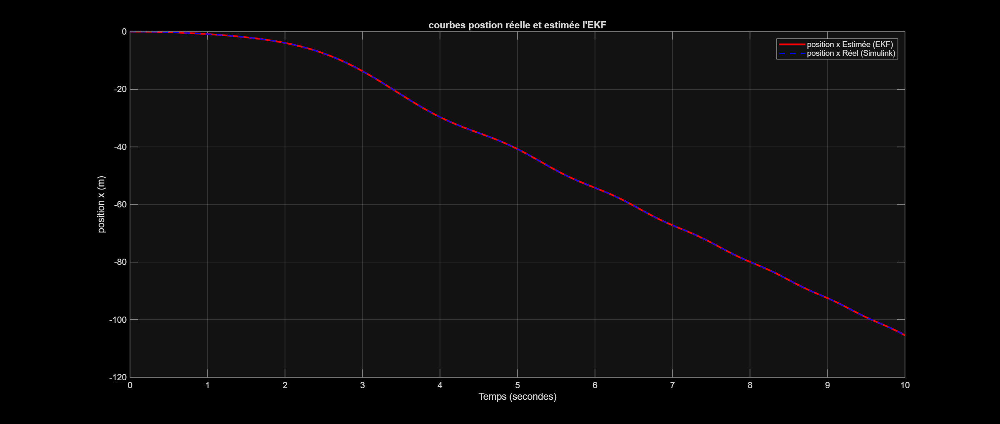
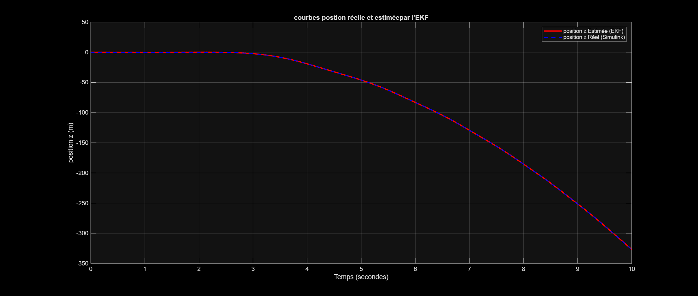
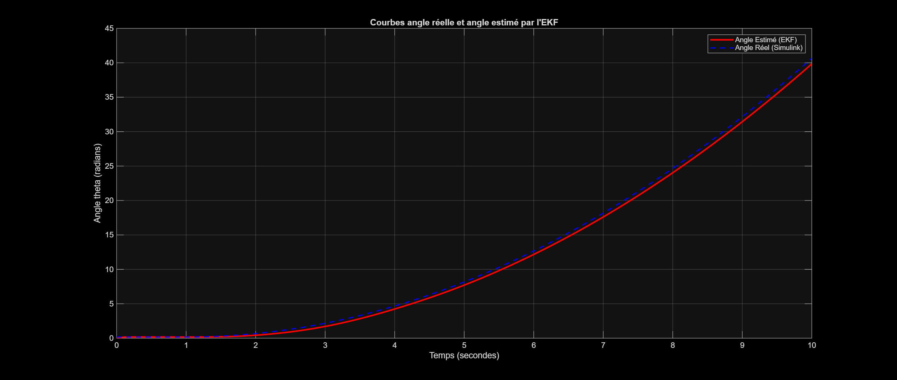
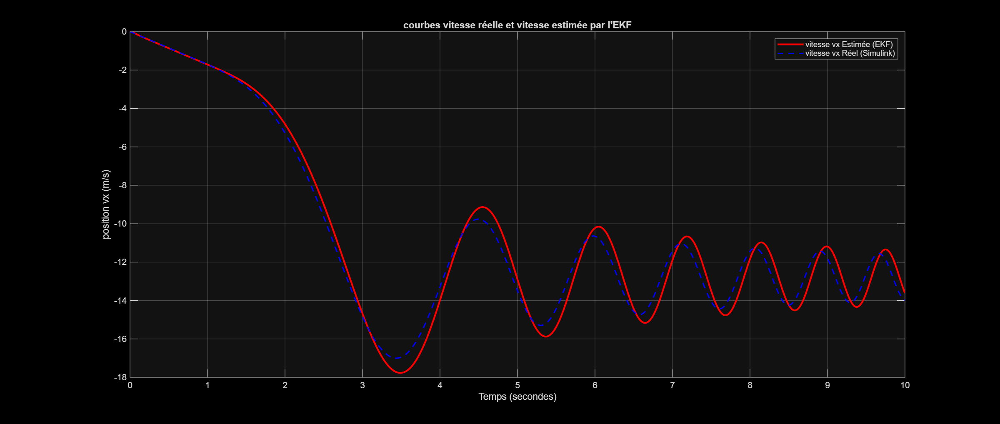
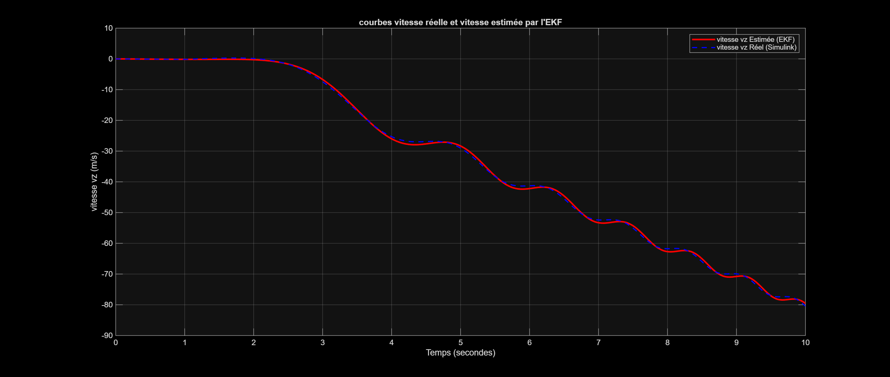
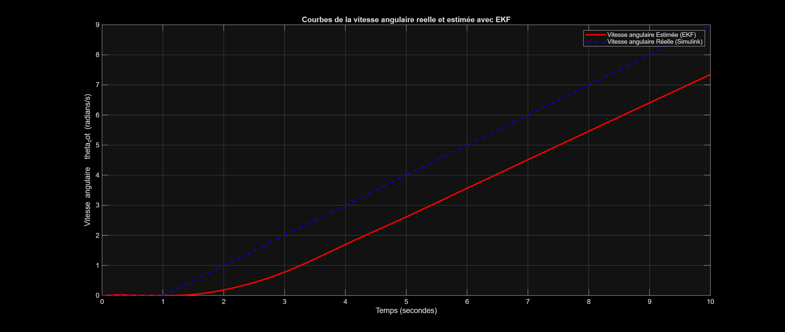

# Contrôle de vol d'un quadricoptère

## Présentation

Ce projet porte sur l'étude de la modélisation, de l'analyse, de la
commande et de l'estimation d'état d'un quadricoptère évoluant dans un
plan vertical.

Le travail a été réalisé sous MATLAB et Simulink, en considérant 
le modèle dynamique non linéaire, et plusieurs modèles linéarisés autour
de différents points d'équilibre.

L'objectif est d'étudier progressivement la chaîne de contrôle et
d'estimation d'un système aéronautique autonome.

## Objectifs

- Modéliser le comportement dynamique non linéaire du quadricoptère.
- Linéariser le modèle autour de différents points d'équilibre.
- Étudier la commandabilité et l'observabilité du système.
- Concevoir un observateur de Luenberger par placement de pôles.
- Implémenter un observateur non linéaire sous Simulink.
- Discrétiser le modèle pour une étude en temps discret.
- Implémenter un filtre de Kalman étendu (EKF).
- Concevoir une commande par retour d'état.
- Étudier l'ajout d'une action intégrale.
- Valider les différentes approches par simulation.

---

## 1. Modèle dynamique

Le système étudié est un modèle simplifié d'un quadricoptère évoluant
dans un plan vertical.

Le vecteur d'état est défini par :

$$
X =
\begin{bmatrix}
x & z & v_x & v_z & \theta & \dot{\theta}
\end{bmatrix}^{T}
$$

avec :

 - $\(x\)$ : position horizontale ;
 - $\(z\)$ : position verticale ;
 - $\(v_x\)$ : vitesse horizontale ;
 - $\(v_z\)$ : vitesse verticale ;
 - $\(\theta\)$ : angle d'attitude ;
 - $\(\dot{\theta}\)$ : vitesse angulaire.
  
Après transformation des variables de commande, la dynamique utilisée
dans le projet est donnée par :

$$
\begin{aligned}
\dot{x} &= v_x \\
\dot{z} &= v_z \\
\dot{v}_x &= c\*v_2\cos(\theta)-v_1\sin(\theta) \\
\dot{v}_z &= c\*v_2\sin(\theta)+v_1\cos(\theta)-g \\
\dot{\theta} &= \dot{\theta} \\
\ddot{\theta} &= v_2
\end{aligned}
$$

avec $v_1$ et $v_2$ les signaux de commandes su systtèmes

## 2. Linéarisation du modèle

Afin d'étudier le comportement local du système, le modèle non linéaire
est linéarisé autour de 03 points d'équilibre :
- $\theta_e = 0^\circ$
- $\theta_e = 10^\circ$
- $\theta_e = 20^\circ$
  
Les matrices obtenues pour 10° et 20° montrent que la
dynamique locale dépend de l'angle d'équilibre.
Cette étude permet notamment d'observer l'évolution du couplage entre
les mouvements horizontaux, verticaux et l'attitude lorsque le point
de fonctionnement change.

## 3.Observatieur d'état

Une première estimation des états est réalisée à l'aide d'un observateur
de Luenberger conçu par placement de pôles.

L'observateur est ensuite intégré au modèle non linéaire afin de comparer
les états réels aux états estimés.

## 4. Passage au temps discret

Le modèle est ensuite discrétisé avec une période d'échantillonnage de
$T_e = 0.01\,s$.

## 5. Filtre de kalman etendu 
Un filtre de Kalman étendu (EKF) est ensuite implémenté  afin d'estimer les six
états du quadricoptère à partir du modèle non linéaire et des mesures de position $x$ et $z$.
### Estimation des positions horizontale, verticale et angulaire

Les positions estimées suit très fidèlement les positions réelles obtenues par
simulation, avec une superposition quasiment complète des deux courbes
sur l'ensemble de la simulation.
### Estimation des vitesses horizontale, verticale 
L'EKF estime les vitesses horizontale et verticales, mais nous remarquons des petits dephasages entre es vitesses réelles et les vitesses estimées par l'EKF .

### Estimation de vitesse angulaire

La figure met en évidence une bonne tendance générale de l'estimation,
mais également un écart entre la vitesse angulaire réelle et son
estimation sur une partie de la simulation.Cette différence constitue un point d'analyse intéressant pour améliorer le réglage du filtre et les hypothèses du modèle.
